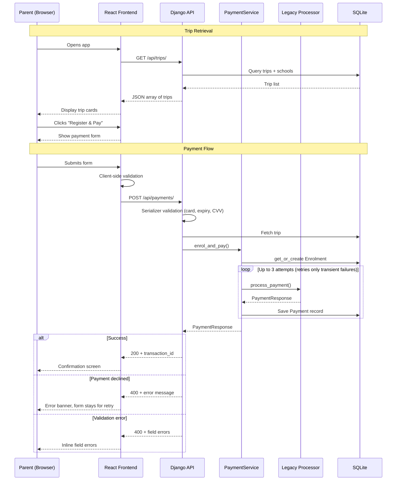

# Kindo Challenge — School Trip Payment System

A full-stack application for parents to browse school trips, register their child, and make a payment via a legacy payment processor. Built with Django + Django REST Framework on the backend and React + TypeScript on the frontend.

## Solution Overview

The app is a three-step flow: parents browse available school trips, fill in registration and payment details, and receive a confirmation with their transaction ID.

**Backend** — A Django REST Framework API with two main endpoints: trip listing and payment processing. The payment endpoint validates card details, creates an enrolment record, and calls the provided legacy payment processor with automatic retry logic for transient failures. Every payment attempt (success or failure) is recorded for audit.

**Frontend** — A single-page React app with a step-based flow (no router needed). Tailwind CSS for styling with Kindo brand colour (#00acc9). Client-side validation mirrors backend rules, and progressive loading messages keep parents informed during the 1.5s+ processor wait.

### Tech Stack

| Layer    | Stack                                                  |
|----------|--------------------------------------------------------|
| Backend  | Python 3.14, Django 6, Django REST Framework, SQLite   |
| Frontend | React 19, TypeScript, Vite 8, Tailwind CSS 4           |
| Testing  | pytest + pytest-django (backend), Vitest + Testing Library (frontend) |

### App Flow

```
Trip Selection  →  Registration & Payment Form  →  Confirmation
                         ↑                              |
                         └────── (retry / back) ────────┘
```

### Sequence Diagram



## Setup Instructions

### Prerequisites

- Python 3.14+ with [uv](https://docs.astral.sh/uv/) package manager
- Node.js 18+

### Backend

```bash
# Install dependencies
uv sync

# Run migrations (creates SQLite DB + seeds sample data)
uv run python manage.py migrate

# Start the dev server on http://localhost:8000
uv run python manage.py runserver
```

Seed data (a school and sample trips) is loaded automatically via a data migration — no manual setup needed.

Django admin is available at `/admin/`:
```bash
uv run python manage.py createsuperuser
```

### Frontend

```bash
cd frontend
npm install
npm run dev
# Runs on http://localhost:5173
```

The frontend connects to the Django API at `localhost:8000` via CORS (configured in `config/settings.py`).

### Running Tests

```bash
# Backend
uv run pytest

# Frontend
cd frontend && npm run test:run
```

## Assumptions & Design Decisions

### No Student Model

The challenge only requires a student's name during registration — no auth, dashboards, or multi-trip history. A full `Student` model would be over-engineering. `student_name` lives as a string on `Enrolment`. If requirements grew, extracting a model would be straightforward.

### Enrolment as Explicit Join Entity

Rather than a flat payment submission, `Enrolment` represents "this student is registered for this trip." It enables:
- Multiple payment attempts per enrolment (FK from Payment → Enrolment)
- De-duplication via `unique_together` on `(trip, student_name)` and `get_or_create`
- Clean separation between registration data and payment data

### Full Payment Audit Trail

Every payment attempt is a separate `Payment` record, including failures. The legacy processor has a 10% random failure rate, so retries are expected. Storing `transaction_id` (success) and `error_message` (failure) enables debugging and reconciliation.

### Service Layer Pattern

Business logic lives in `PaymentService` (`payments/services.py`), not in the views. The view handles HTTP concerns; the service handles domain logic (enrolment creation, processor integration, retry decisions). This keeps views thin and makes the core logic testable without HTTP overhead.

### Selective Retry Strategy

The legacy processor returns the same type for validation errors and transient failures. We only retry on the specific transient message (`"Payment declined by processor. Please try again."`). Validation errors (bad card, bad CVV) are returned immediately — no point retrying requests that will never succeed. The string-matching is brittle but isolated in a single `_is_retryable` method.

### Backend Derives Sensitive Values

The frontend sends only what the parent types: `trip_id`, names, and card details. The backend derives `amount` from `trip.cost`, `school_id` from `trip.school_id`, and `activity_id` from `trip.id`. This prevents the frontend from controlling the charge amount.

### Other Assumptions

- SQLite is sufficient for the challenge scope (no concurrent write pressure)
- The 1.5s synchronous processor delay is acceptable; in production this would be async (Celery / task queue)
- Card details are validated but never stored beyond the last four digits
- CORS is configured for the Vite dev server origin (`localhost:5173`) only

See `specs/04-decisions.md` for production considerations (idempotency keys, circuit breakers, database transactions, observability).

## AI Tool Usage

### Approach

I used a two-phase approach:

**Phase 1 — Manual exploration.** I built the data model, first API endpoints, DRF serializers with custom validation, the payment service layer, and retry logic by hand. This gave me a solid understanding of Django and DRF's patterns and let me make informed architectural decisions rather than blindly accepting generated code.

**Phase 2 — Spec-Driven Development.** Once I had a strong mental model of the system, I wrote detailed specification documents (see the `specs/` directory) covering the data model, API contract, frontend behaviour, and design rationale. I then used Claude Code to rapidly implement the remaining work — frontend build, backend polish, styling, and tests — with every generated output reviewed against the specs and my understanding of the system.

### Tools Used

- **Claude** (Anthropic) — architectural discussion, spec authoring, code review
- **Claude Code** — implementation from specs, test generation

### Why This Approach

The challenge explicitly encourages AI tool usage while also evaluating whether the candidate can identify when tools are "hallucinating or going awry." Building the core backend by hand ensured I could catch issues in generated code, while the spec-driven handoff kept the AI-generated work aligned with intentional design decisions.

## Project Structure

```
kindo-challenge/
├── config/                 # Django project config (settings, URLs, WSGI/ASGI)
├── payments/               # Django app
│   ├── models.py           # School, Trip, Enrolment, Payment
│   ├── serializers.py      # DRF serializers with card validation
│   ├── views.py            # API views (TripViewSet, PaymentView)
│   ├── services.py         # PaymentService with retry logic
│   ├── legacy_processor.py # Provided payment processor simulation
│   ├── admin.py            # Django admin registration
│   ├── conftest.py         # pytest fixtures
│   └── tests/              # Unit + integration tests
├── frontend/src/
│   ├── components/         # TripList, TripCard, PaymentForm, Confirmation, etc.
│   ├── api/client.ts       # Fetch wrapper for Django API
│   ├── types/index.ts      # TypeScript interfaces
│   └── App.tsx             # Root component (step-based flow)
├── specs/                  # Design specifications and decision docs
└── pyproject.toml          # Python project config (uv)
```

### Data Model

```
School 1──* Trip 1──* Enrolment 1──* Payment
```
